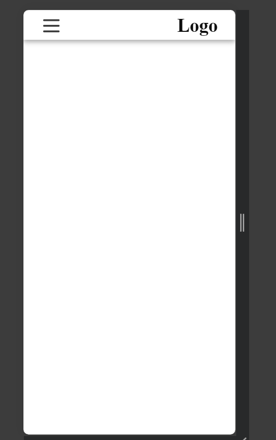
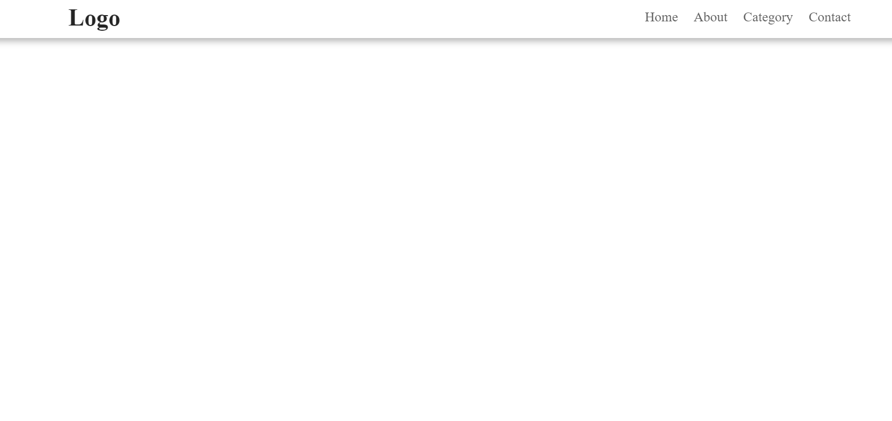

# Navbar 

This project template provides a simple and responsive navigation bar with buttons. It includes basic styles and JavaScript to manage navigation interactions like highlighting the current active button, smooth scrolling to sections, and mobile responsiveness.

## Preview

## Getting Started

Follow the instructions below to get a copy of this project up and running on your local machine for development and testing purposes.

### Prerequisites

Before you begin, make sure you have the following installed on your local machine:

- A modern web browser (Chrome, Firefox, Edge, etc.)
- Code editor (e.g., VSCode, Sublime Text)
- Basic knowledge of HTML, CSS, and JavaScript

