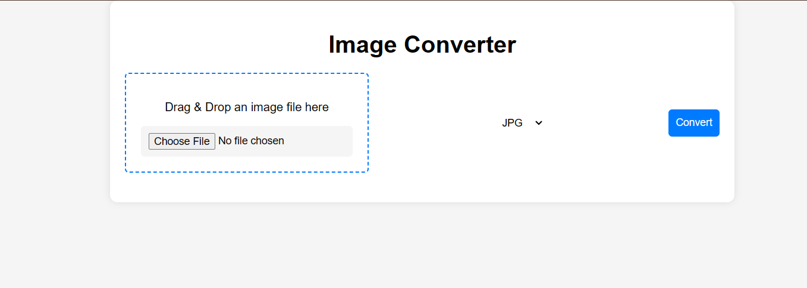

# JPG to PNG / PNG to JPG Converter

A simple web-based converter that allows users to convert images between JPG and PNG formats. This project is built using HTML, CSS, and JavaScript.

## Features

- **Upload Images:** Users can upload JPG or PNG images.
- **Convert Formats:** The tool allows converting from JPG to PNG or vice versa.
- **Download Converted Image:** Once converted, users can download the image in the desired format.
- **Drag and Drop Support:** Users can drag and drop images for quick conversion.
- **Responsive Design:** The app is fully responsive and works on both desktop and mobile devices.

## Technologies Used

- **HTML5:** Structure of the web application.
- **CSS3:** Styling the interface.
- **JavaScript:** Handling the image conversion logic.

## Installation

To get a local copy up and running follow these simple steps.

### Prerequisites

Ensure you have a modern browser installed (Chrome, Firefox, etc.).

### output 

